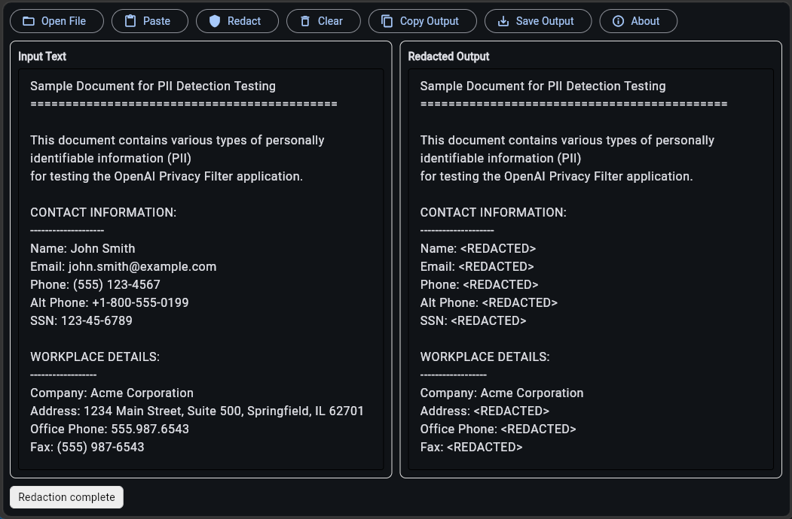

# Open Privacy Filter GUI

A lightweight Python desktop (and local web) application for redacting sensitive data from text using OpenAI's Privacy Filter model.



## ✨ Features

- **One-click redaction** with real-time output
- **Copy to clipboard** or **save as new file**
- Clean, minimal Flet interface -- opens as desktop app or, failing that, a local web app
- Works on Windows, macOS, and Linux

## 📦 Requirements

|        Package             |                   Install Command                    |
|----------------------------|------------------------------------------------------|
| Git                        | See [Git-SCM](https://git-scm.com/)                  |
| Python 3.14+               | See [python.org](https://www.python.org/)            |
| `flet` v0.86.5+            | `pip install flet`                                   |
| OpenAI Privacy Filter      | See setup steps below                                |

## 🚀 Quick Setup

```bash
# 1. Clone and install the OpenAI Privacy Filter
git clone https://github.com/openai/privacy-filter.git
cd privacy-filter
pip install -e .

# 2. Install flet
pip install flet

# On Ubuntu Linux systems, you may need to install flet with, e.g.:
pip install flet-desktop==0.86.5 --upgrade --break-system-packages
```

## 💡 Usage

### Launch the App

**Terminal:**
```bash
python opflet.py
```

**Windows:**
1. Double-click `launch.bat`
2. *(Optional)* Copy `launch.bat` to your Desktop → right-click → **Paste shortcut** → rename to *OpenAI Privacy Filter GUI* for quick access.

### Workflow

1. **Input** – Open a text file into the left panel or just paste in text.
2. **Redact** – Click **Redact**. The model processes the text and displays results in the right panel.
3. **Export** – Click **Copy Output** to clipboard, or **Save Output** to write a new file.
4. **Clear** – Reset both panels to start fresh. (Optional)
5. **Quit** – Close the window or use the system close button.

## 🔧 Troubleshooting

|            Issue              |                    Fix                      |
|-------------------------------|---------------------------------------------|
| `launch.bat` fails on Windows | Ensure Python is in your `PATH`             |
| Slow redaction                | Run on GPU (CUDA) or reduce input text size |

## 📁 Project Structure

```
opflet/
├── opflet.py                # Main GUI application
├── launch.bat               # Windows launcher
├── test-document.txt        # Test input file
├── opflet_screenshot.png    # GUI screenshot
├── LICENSE.txt              # Apache 2.0 license file
└── README.md                # This file
```

## 📝 License

Apache 2.0 License. See [LICENSE](LICENSE.txt) for details.
